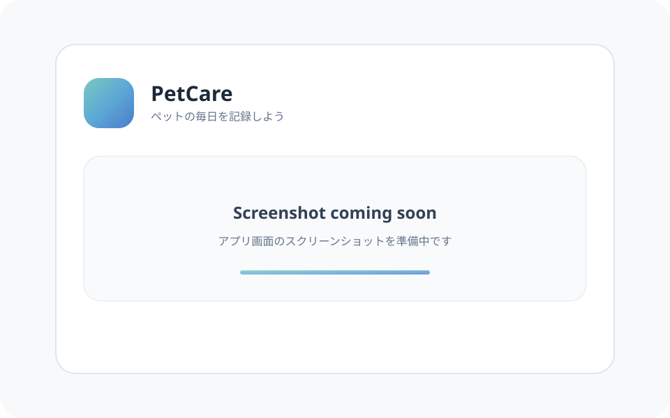

# PetCare

PetCareは、犬・猫の毎日の健康状態や通院内容、体重を気軽に記録し、振り返るためのWebアプリです。

病院のカルテのように堅くなりすぎず、清潔感・安心感・親しみやすさを感じられる体験を目指しています。短時間で記録できるフォーム、日別タイムライン、期間別の傾向、記録を整理するモックAI相談を備えています。

> データは端末・ブラウザごとの`localStorage`に保存され、クラウドには同期されません。ブラウザデータを削除すると記録も削除されるため、必要に応じてJSONバックアップをご利用ください。

## スクリーンショット



実際の画面が公開可能になり次第、モバイル表示を中心としたスクリーンショットへ差し替える予定です。

## 主な機能

- **うんちログ**：日時、状態、食糞、ユーザー設定可能な場所、メモを記録
- **ごはんログ**：食事の種類、食べた量、メモを記録
- **さんぽログ**：開始日時、所要時間、メモを記録
- **病院ログ**：受診日時、病院名、受診理由、診断、処方薬、費用、次回受診日、メモを記録
- **体重ログ**：記録日時、0.01kg単位の体重、メモを記録
- **タイムライン**：5種類のログを日付・時刻順にまとめ、編集・削除
- **Trends**：体重、さんぽ、ごはん、うんち、病院の記録を7日・30日・90日で集計し、数値、簡易グラフ、前期間との事実ベースの気づきを表示
- **AI相談（モック）**：プロフィールと7日間の記録を整理し、確認ポイントを構造化して表示
- **プロフィール**：犬・猫の基本情報、年齢計算、デフォルトアイコン、画像クロップ
- **データ管理**：プロフィール、ログ、場所設定のJSON書き出し・読み込み・一括削除
- **端末内保存**：`localStorage`へ保存し、再読み込み後も復元

## 記録カテゴリの設計

- **毎日の記録**：さんぽ、ごはん、うんちなど、高頻度で記録する日常の行動
- **ケアの記録**：病院、体重、ワクチン、お薬、トリミングなど、低頻度で行う健康管理や定期的なケア

現在、ケアの記録では病院ログと体重ログを実装しています。ワクチン、お薬、トリミングは将来の追加候補です。

## 技術構成

| 分類 | 技術 |
| --- | --- |
| フレームワーク | Astro |
| UI | React |
| スタイリング | Tailwind CSS |
| 言語 | TypeScript |
| アイコン | Lucide React、共通カスタムSVG |
| フォント | LINE Seed JP |
| データ保存 | Web Storage API（`localStorage`） |

## Third-party assets

The dog and cat profile icons used in PetCare are provided by ICOOON MONO.

- Provider: ICOOON MONO
- Copyright: TopeconHeroes
- These assets are not covered by this repository's MIT License.
- Use and redistribution of these assets are subject to the terms of ICOOON MONO.

## ディレクトリ構成

```text
petcare/
├── docs/                  # 要件とスクリーンショット
├── public/                # 静的ファイル
├── src/
│   ├── components/        # 各種記録フォーム、日付カード、相談画面
│   ├── layouts/           # 共通レイアウト
│   ├── pages/             # ホーム、履歴、傾向、設定、プロフィール・記録設定
│   ├── styles/            # グローバルスタイル
│   ├── types/             # プロフィール、健康ログ、相談データの型
│   └── utils/             # 保存、時系列・集計、相談データ生成
├── BACKLOG.md             # 今後の開発候補
├── CHANGELOG.md           # リリース履歴
└── PROJECT.md             # 設計方針と責務
```

## セットアップ

### 必要な環境

- Node.js 22.12.0以上
- npm

### 起動方法

GitHubリポジトリURLは公開時に追記予定です。取得済みのプロジェクトフォルダで次を実行してください。

```bash
npm install
npm run dev
```

開発サーバー起動後、ターミナルに表示されたURLをブラウザで開いてください。

バックグラウンドで起動する場合：

```bash
npm run astro -- dev --background
```

### ビルド

```bash
npm run build
```

生成されたサイトをローカルで確認する場合：

```bash
npm run preview
```

## データのバックアップ

Settingsの「データ管理」から、現在のプロフィール、うんち・ごはん・さんぽ・病院・体重記録、場所設定をJSONファイルへ書き出せます。ファイル名は`PetCare-YYYY-MM-DD.json`です。

復元する場合は「読み込む」から、PetCareで書き出したJSONファイルを選択してください。読み込みを実行すると、現在ブラウザに保存されているデータはバックアップ内容で上書きされます。

データは引き続きブラウザ内の`localStorage`に保存されます。ブラウザデータの削除や「すべて削除」を実行する前に、必要に応じてバックアップしてください。

## 今後追加予定の機能

- 記録の検索・絞り込み
- フードマスターと食事量の詳細管理
- 気づきの長期変化、表示設定、AI相談との連携
- 毛色とより詳細な医療情報
- 複数ペットへの対応
- 写真付き記録
- カレンダー表示と長期的な健康傾向
- 薬、水分などの健康ログ
- 複数端末での同期とログイン

優先順位や検討状況は[BACKLOG.md](BACKLOG.md)、リリースごとの変更内容は[CHANGELOG.md](CHANGELOG.md)を参照してください。

## ドキュメント

- [プロジェクト方針](PROJECT.md)
- [Sprint 1要件](docs/requirements.md)
- [ロードマップ](BACKLOG.md)
- [変更履歴](CHANGELOG.md)

## GitHub公開準備

`repository`、`homepage`、`bugs`のURLは未確定のため、package.jsonへダミーURLを設定していません。リポジトリ公開時に実URLを追記します。

## ライセンス

アプリケーションのソースコードは[MIT License](LICENSE)で提供します。

`public/icons/profile/`の提供SVG素材は、元ファイルに出典・ライセンス情報が含まれていません。これらの素材はMIT Licenseの対象と断定せず、公開前に配布元と利用条件を確認してください。詳細は[プロフィールアイコン素材の管理メモ](docs/profile-icon-assets.md)を参照してください。
