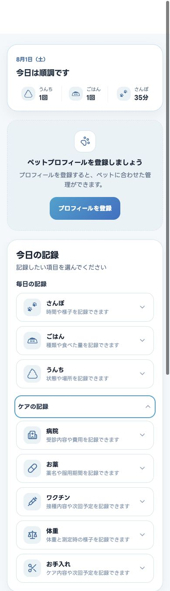
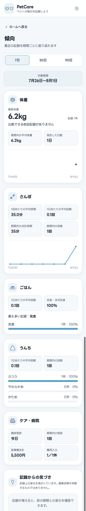
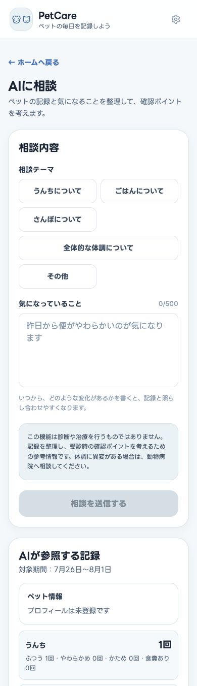

# 🐶🐱 PetCare


PetCareは、犬や猫との毎日を記録し、健康の変化を振り返るためのWebアプリです。

さんぽ・ごはん・うんちから、気になる体調・体重・病院・お薬・ワクチン・お手入れまでをまとめて記録し、期間ごとの傾向や記録上の変化を確認できます。初めて使うときはHomeのガイドから記録を始められ、記録はブラウザ内に保存してJSON形式でバックアップできます。

## Live Demo

[PetCareを開く](https://petcare-cyan-theta.vercel.app/)

> 現在、データは端末・ブラウザごとの`localStorage`に保存されます。クラウド同期には対応していません。

## Screenshots

### Home

毎日の記録と、必要なときに開けるケアの記録をひとつの画面にまとめています。



### Trends

期間を切り替えながら、体重や毎日の記録、病院の記録を振り返れます。



### Record Review

保存した記録をブラウザ内で分析し、相談内容と直近7日間の記録を整理できます。



## Features

### 毎日の記録

- **さんぽ**：日時、散歩時間、メモ
- **ごはん**：食事の種類、食べた量、メモ
- **うんち**：日時、状態、食糞、ユーザー設定可能な場所、メモ

### ケアの記録

- **気になる体調**：固定候補と「その他」から複数の様子を選び、日時とメモを記録
- **病院**：受診内容、診断・説明、処方薬、費用、次回受診日
- **体重**：0.01kg単位の体重とメモ
- **お薬**：薬名、用量、服用タイミング、服用期間、処方した病院
- **ワクチン**：ワクチン名、病院名、費用、次回予定日
- **お手入れ**：複数のケア内容、実施場所、費用、次回予定日

すべての記録は新規登録・編集・削除に対応し、Homeと健康記録画面の共通タイムラインへ日時順に表示されます。

### 傾向

- 7日・30日・90日の期間切り替え
- 体重の推移、最新値、期間平均、前回差
- さんぽ時間、ごはんの摂取状況、うんちの状態を集計
- 気になる体調の記録件数・内容別の内訳・最新日時を期間ごとに表示
- 病院の受診回数と医療費を表示

気になる体調は保存された件数を事実として表示し、診断や健康評価は行いません。

### 記録からの気づき

- 選択期間と直前の同じ長さの期間をルールベースで比較
- 件数・割合・合計時間など、記録から確認できる事実のみを表示
- 健康評価、診断、原因推測は行わない設計

### 記録分析と相談内容の整理（モック）

- 食糞が記録された時間・場所、直近30日の体重変化を固定質問から分析
- メモに含まれる定義済みの言葉、直近30件のうんち状態、病院・ケアの記録件数をブラウザ内で集計
- 食糞ありの日、ごはんを食べなかった日、最新の病院受診前7日間について、複数種類の記録を日単位・期間単位で集計
- 定義済みのメモ注目語を選び、その言葉を含むメモが記録された日のログをブラウザ内で集計
- Settingsでカスタム注目語を追加・編集・削除し、メモ分析へ反映
- 短い質問文をブラウザ内のルールで既存分析へ振り分け（AIによる自然言語回答ではありません）
- 分析結果はPetCare内の記録から確認できる事実だけを表示
- プロフィールと直近7日間の記録を相談用データへ整理
- 相談テーマと入力内容に応じた構造化モック回答を表示
- 外部AI APIには未接続

### プロフィールとデータ管理

- 犬・猫のプロフィール、年齢計算、プロフィール画像
- うんちをした場所の選択肢管理
- カスタム注目語の管理
- 気になる体調の記録を含むJSON形式のバックアップ、復元、全データ削除
- localStorageを利用できない場合の警告
- 機種変更・ブラウザ移行・ホーム画面追加前のバックアップ案内

PetCareのデータはクラウドへ自動保存されません。プライベートブラウズでは終了後に記録が残らない場合があるため、通常のブラウジングモードでの利用と定期的なバックアップをおすすめします。

## Tech Stack

| 分類 | 技術 |
| --- | --- |
| Framework | Astro 7 |
| Interactive UI | React 19 |
| Language | TypeScript 6 |
| Styling | Tailwind CSS 4 |
| Icons | Lucide React、カスタムSVG |
| Font | LINE Seed JP |
| Storage | Web Storage API（`localStorage`） |
| Hosting | Vercel |
| Test | Node.js Test Runner |

## Local Development

Node.js 22.12.0以上とnpmが必要です。

```bash
git clone https://github.com/ptks-srtm/petcare.git
cd petcare
npm install
npm run dev
```

品質チェックとプロダクションビルドは次のコマンドで実行できます。

```bash
npm test
npm run astro -- check
npm run build
```

## Project Structure

```text
petcare/
├── public/              # favicon、manifest、静的アセット
├── docs/                # 要件、素材情報、スクリーンショット
├── src/
│   ├── components/      # 記録フォーム、カード、対話UI
│   ├── layouts/         # 共通HTMLレイアウト
│   ├── pages/           # Astroのファイルベースルーティング
│   ├── styles/          # デザイントークンと共通スタイル
│   ├── types/           # ログ・プロフィール・相談データの型
│   └── utils/           # 保存、集計、バックアップ、検証
├── BACKLOG.md           # 今後の開発候補
└── CHANGELOG.md         # リリース履歴
```

## Roadmap

- [ ] AI相談の外部API接続と回答体験の改善
- [ ] 英語対応
- [ ] 犬・猫それぞれに合わせた入力項目の最適化
- [ ] 複数頭のプロフィールと記録管理
- [ ] 認証を伴う複数ユーザー管理

詳しい検討内容は[BACKLOG.md](BACKLOG.md)、リリース履歴は[CHANGELOG.md](CHANGELOG.md)を参照してください。

## License

PetCareのソースコードは[MIT License](LICENSE)で提供しています。

## Third-party assets

The dog and cat profile icons used in PetCare are provided by ICOOON MONO.

- Provider: ICOOON MONO
- Copyright: TopeconHeroes
- These assets are not covered by this repository's MIT License.
- Use and redistribution of these assets are subject to the terms of ICOOON MONO.

プロフィールアイコン素材の管理方針は[docs/profile-icon-assets.md](docs/profile-icon-assets.md)を参照してください。
